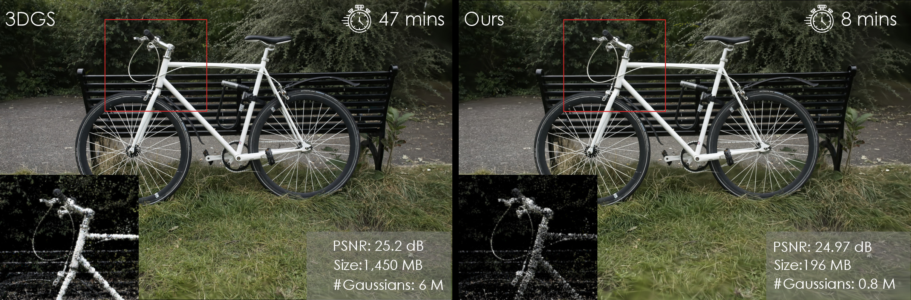

# Taming 3DGS: High-Quality Radiance Fields with Limited Resources
Saswat Subhajyoti Mallick*, Rahul Goel*, Bernhard Kerbl, Francisco Vicente Carrasco, Markus Steinberger, Fernando De La Torre (* indicates equal contribution)

[](https://arxiv.org/abs/2406.15643)
[](https://humansensinglab.github.io/taming-3dgs/)

<p align="center">
    
</p>

**TL;DR** We improve the densification process to make the primitive count deterministic and implement several low-level optimizations for fast convergence.

## Usage
Clone the repository
```bash
git clone https://github.com/humansensinglab/taming-3dgs.git --recursive
```
Follow the instructions in the [original 3DGS repository](https://github.com/graphdeco-inria/gaussian-splatting) to setup the environment.

<details>
<summary><span style="font-weight: bold;">additional flags for train.py</span></summary>

  #### --cams
  Number of cameras required to compute gaussian scores. Default set to 10.
  #### --budget
  The final number of gaussians to end up with. Can be a float or an integer based on `--mode`.
  #### --mode
  multiplier: the final count of gaussians will be `multiplier` x the initial (SfM) count <br>
  final_count: the final count of gaussians will be set exactly to `final_count`.
  #### --websockets
  Whether to use the web based viewer or not.
  #### --ho_iteration
  High opacity gaussians will be enabled from which iteration. Defaults to 15000 (after densification ends).
  #### --sh_lower
  Whether to enable less-frequent (once every 16 iterations) SH updates to gain speed.
  #### --benchmark_dir
  The location of the folder where the timing results are stored. No time profiling will be done if left blank.
</details>
<br>

To reproduce the scores in our paper, please run `train.sh`

## Web viewer
We provide a basic browser-based renderer to track the training progress. Steps for usage are as follows: <br>
1. Move the [web-viewer](./web_viewer/) folder into the host machine from where you wish to view the training.
2. Assign a port number while spawning a training session using `train.py --port <port_num> --websockets`. If you're running this on a remote server, forward the port to your host system.
3. Maintain the same port number in the [app.js](./web_viewer/app.js) file.
4. Open [render.html](./web_viewer/render.html) in your browser.

## Note
The performance optimizations that are **drop-in replacements** for the original implementation are available under the [rasterizer](https://github.com/humansensinglab/taming-3dgs/tree/rasterizer) branch. All the performance optimizations are released under the MIT License. Please refer to the [Inria repository](https://github.com/graphdeco-inria/gaussian-splatting) for complete instructions.

They have also been integrated with the original [Inria repository](https://github.com/graphdeco-inria/gaussian-splatting) so it can be directly used there.

## Citation
If you find this repo useful, please cite:
```
@inproceedings{10.1145/3680528.3687694,
    author = {Mallick, Saswat Subhajyoti and Goel, Rahul and Kerbl, Bernhard and Steinberger, Markus and Carrasco, Francisco Vicente and De La Torre, Fernando},
    title = {Taming 3DGS: High-Quality Radiance Fields with Limited Resources},
    year = {2024},
    isbn = {9798400711312},
    publisher = {Association for Computing Machinery},
    address = {New York, NY, USA},
    url = {https://doi.org/10.1145/3680528.3687694},
    doi = {10.1145/3680528.3687694},
    booktitle = {SIGGRAPH Asia 2024 Conference Papers},
    articleno = {2},
    numpages = {11},
    keywords = {Radiance Fields, Gaussian Splatting},
    series = {SA '24}
}

```
